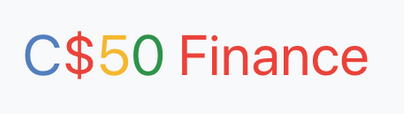

# C$50 Finance

  

### Project

The goal is to implement a website via which users can “buy” and “sell” stocks.  

It uses real time data through an external API.  

The app has 5 sections :
1. Home : current portfolio's holdings, net asset values and cash position
1. Quote : gives you the latest price of a stock
1. Buy : allows users to buy a stock
1. Sell : is where you select among the stocks you own the one you'd like to sell
1. History : keeps track of all your transactions  

The homepage also allows you to buy / sell stocks you already possess, making it easier than the regular buy / sell pages.  

Feel free to leave a comment!  

Tips and suggestions are more than welcome, the goal is to learn and improve :rocket:

### Features

-   Frontend with HTML5 and [Bootstrap](https://getbootstrap.com/)
-   Backend with [Python](https://www.python.org/) using the [Flask](https://flask.palletsprojects.com/en/1.1.x/) microframework
-   [SQLite](https://sqlite.org/index.html) database
-   Password hashing using [Werkzeug Security Helpers](https://werkzeug.palletsprojects.com/en/1.0.x/utils/#module-werkzeug.security)
-   Real time data with [IEX Cloud](https://iexcloud.io/)
-   Use of [PyCharm](https://www.jetbrains.com/pycharm/) as local IDE
-   Hosting on [Heroku](https://www.heroku.com/home)

### Link

If you'd like, you can [try it here](https://cs-50-finance.herokuapp.com)